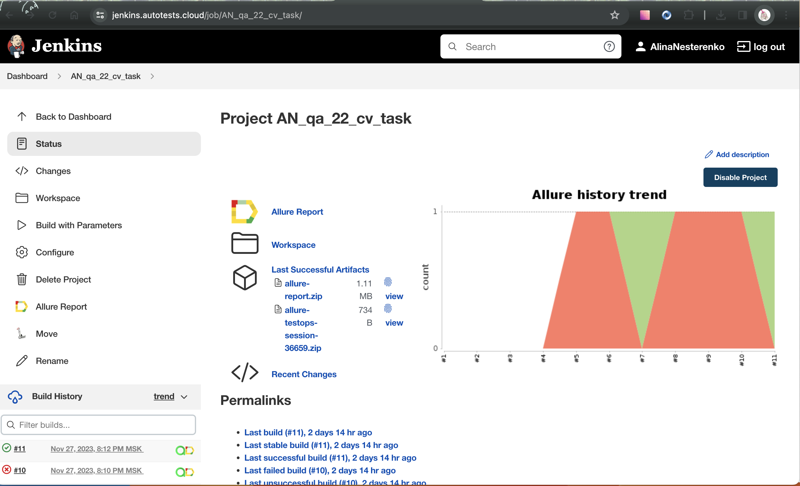
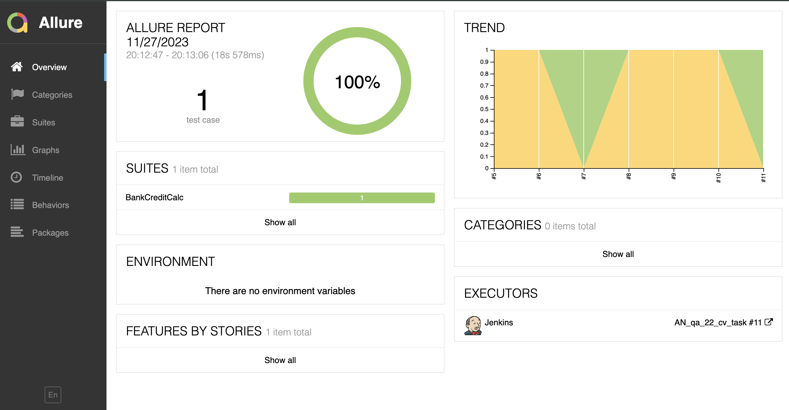
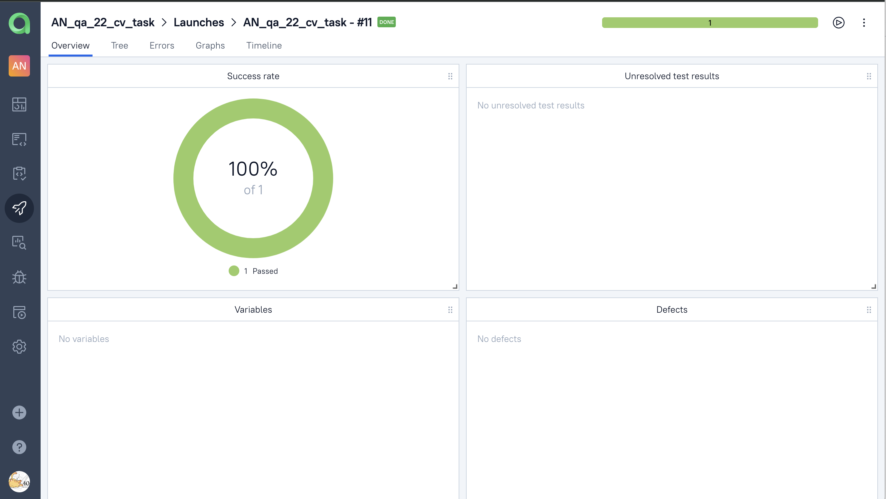
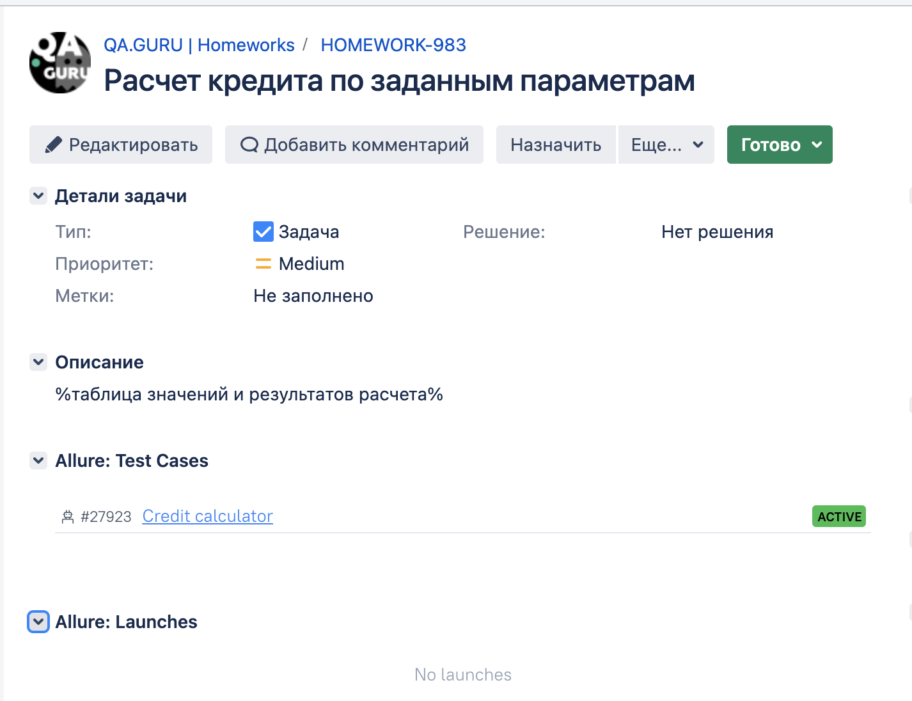
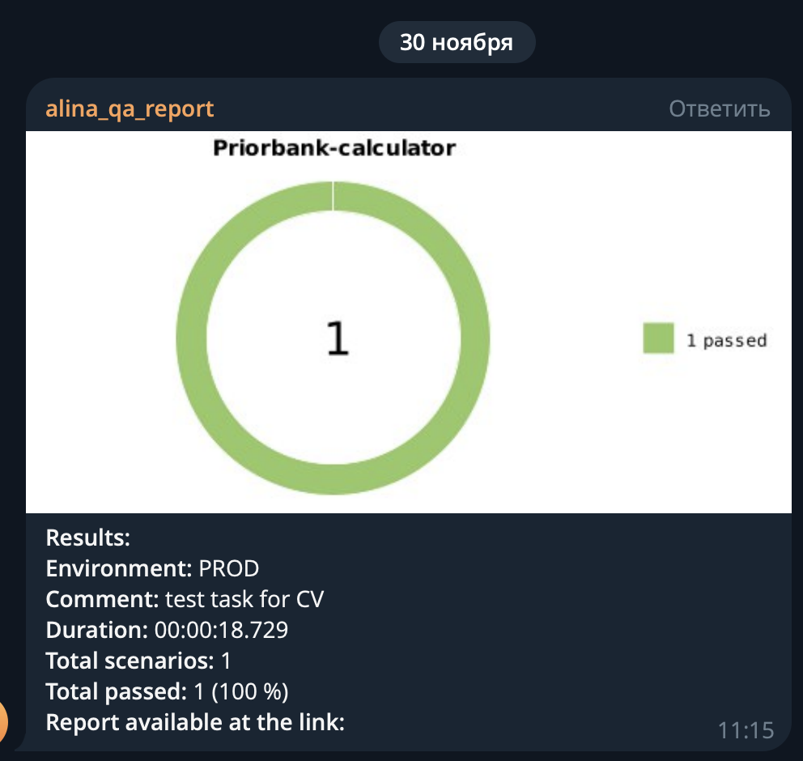
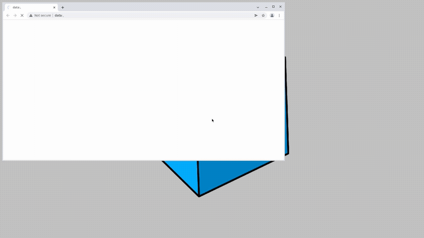

# Проект по автоматизации E2E сценария расчета кредита
## Содержание:

- [Использованный стек](#используемый-стек)
- [Запуск тестов из терминала](#запуск-тестов-из-терминала)
- [Jenkins](#jenkins)
- [Allure-отчет](#Allure-Report)
- [Allure TestOps](#Allure-TestOps)
- [Jira](#jira)
- [Уведомления в Telegram](#уведомления-в-Telegram)
- [Видео запуска тестов](#видео-запуска-тестов)

## Использованный стек

<p align="center">


</p>

- Для автотестов использовался язык <code>Java</code>.
- Cборщиком выступает - <code>Gradle</code>.
- Также используются фреймворки <code>JUnit 5</code> и [Selenide](https://selenide.org/).
- При запуске тестов используется [Selenoid](https://aerokube.com/selenoid/).
- Возможен удаленный запуск тестов через <code>Jenkins</code> с формированием Allure-отчета и отправкой результатов в <code>Telegram</code> при помощи бота.
- Настроена индеграция с <code>Allure TestOps</code> и <code>Jira</code>

Содержание Allure-отчета:
* Шаги теста;
* Скриншот страницы на последнем шаге;
* Page Source;
* Логи браузерной консоли;
* Видео выполнения автотеста.

## Запуск автотестов

### Запуск тестов из терминала
```
gradle clean bank_test
```
При выполнении команды, данные тесты запустятся удаленно в <code>Selenoid</code>.

```
clean bank_test
-Dremote=${remote}
-Dbrowser=${browser}
-Dversion=${version}
-Dsize=${size}
```
Параметры сборки задаются при сборке и могут быть переопределены

### Параметры сборки

* <code>browser</code> – браузер, в котором будут выполняться тесты. По-умолчанию - <code>chrome</code>.
* <code>version</code> – версия браузера, в которой будут выполняться тесты. По-умолчанию - <code>100.0</code>.
* <code>size</code> – размер окна браузера, в котором будут выполняться тесты.
* <code>remote</code> – адрес удаленного сервера, на котором будут запускаться тесты.

## Jenkins
<p align="center">

</p>

## Allure-отчет


</p>

## Allure TestOps

Выполнена интеграция сборки <code>Jenkins</code> с <code>Allure TestOps</code>.
Результат выполнения автотестов отображается в <code>Allure TestOps</code>
На Dashboard в <code>Allure TestOps</code> отображена статистика пройденных тестов.

<p align="center">

</p>

## Jira

Реализована интеграция <code>Allure TestOps</code> с <code>Jira</code>. В Тестовом сценарии в <code>Allure TestOps</code> отображается номер тикета в <code>Jira</code>

 Jira" src="src/media/screenshots/Allure TestOps-Jira.png">
</p>

А в <code>Jira</code> задаче отображается информация, какие тест-кейсы были написаны в рамках задачи.

<p align="center">

</p>

## Уведомления в Telegram

После завершения сборки, бот созданный в <code>Telegram</code>, автоматически обрабатывает и отправляет сообщение с результатом.

<p align="center">

</p>

## Видео запуска тестов

К каждому тесту в отчете прилагается видео прогона.
<p align="center">
  
</p>